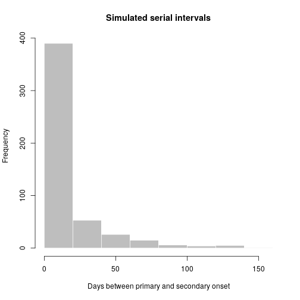

[](https://ci.appveyor.com/project/thibautjombart/epitrix/branch/master)
[](https://travis-ci.org/reconhub/epitrix)
[](https://codecov.io/github/reconhub/epitrix?branch=master)
[](https://cran.r-project.org/package=epitrix)


# Welcome to the *epitrix* package!

This package implements small helper functions usefull in infectious disease
modelling and epidemics analysis.


## Installing the package

To install the current stable, CRAN version of the package, type:

```r
install.packages("epitrix")
```

To benefit from the latest features and bug fixes, install the development,
*github* version of the package using:


```r
devtools::install_github("reconhub/epitrix")
```

Note that this requires the package *devtools* installed.


# What does it do?

The main features of the package include:

- **`gamma_shapescale2mucv`**: convert shape and scale of a Gamma distribution
    to mean and CV

- **`gamma_mucv2shapescale`**: convert mean and CV of a Gamma distribution to
    shape and scale

- **`gamma_log_likelihood`**: Gamma log-likelihood using mean and CV

- **`r2R0`**: convert growth rate into a reproduction number

- **`lm2R0_sample`**: generates a distribution of R0 from a log-incidence linear
    model

- **`fit_disc_gamma`**: fits a discretised Gamma distribution to data (typically
    useful for describing delays)

- **`hash_names`**: generate unique, anonymised, reproducible labels from
    various data fields (e.g. First name, Last name, Date of birth).


# Resources

## Worked examples


### Fitting a gamma distribution to delay data

In this example, we simulate data which replicate the serial interval (SI),
i.e. the delays between primary and secondary symptom onsets, in Ebola Virus
Disease (EVD). We start by converting previously estimates of the mean and
standard deviation of the SI (WHO Ebola Response Team (2014) NEJM 371:1481–1495)
to the parameters of a Gamma distribution:


```r
mu <- 15.3 # mean in days days
sigma <- 9.3 # standard deviation in days
cv <- mu/sigma # coefficient of variation
cv
```

```
## [1] 1.645161
```

```r
param <- gamma_mucv2shapescale(mu, cv) # convertion to Gamma parameters
param
```

```
## $shape
## [1] 0.3694733
## 
## $scale
## [1] 41.4103
```

The *shape* and *scale* are parameters of a Gamma distribution we can use to
generate delays. However, delays are typically reported per days, which implies
a discretisation (from continuous time to discrete numbers). We use the package
[*distcrete*](https://github.com/reconhub/distcrete) to achieve this discretisation. It generates a list of functions, including one to simulate data (`$r`), which we use to simulate 100 delays:


```r
si <- distcrete::distcrete("gamma", interval = 1,
               shape = param$shape,
               scale = param$scale, w = 0)
si
```

```
## A discrete distribution
##   name: gamma
##   parameters:
##     shape: 0.369473279507882
##     scale: 41.4103017689906
```

```r
x <- si$r(100)
head(x, 10)
```

```
##  [1] 12  1 73 32  0  9  0 36  5 50
```

```r
hist(x, col = "grey", border = "white",
     xlab = "Days between primary and secondary onset",
     main = "Simulated serial intervals")
```



`x` contains simulated data, for illustrative purpose. In practice, one would
use real data from an ongoing outbreaks. Now we use `fit_disc_gamma` to estimate
the parameters of a dicretised Gamma distribution from the data:


```r
si_fit <- fit_disc_gamma(x)
si_fit
```

```
## $mu
## [1] 12.57519
## 
## $cv
## [1] 1.518508
## 
## $sd
## [1] 19.09553
## 
## $ll
## [1] -332.3606
## 
## $converged
## [1] TRUE
```


### Converting a growth rate (r) to a reproduction number (R)


### Anonymising data


## Vignettes

Vignettes are still in development.


## Websites

A dedicated website is still in development.


## Getting help online

Bug reports and feature requests should be posted on *github* using the
[*issue*](http://github.com/reconhub/epitrix/issues) system. All other questions
should be posted on the **RECON forum**: <br>
[http://www.repidemicsconsortium.org/forum/](http://www.repidemicsconsortium.org/forum/)

Contributions are welcome via **pull requests**.

Please note that this project is released with a [Contributor Code of
Conduct](CONDUCT.md). By participating in this project you agree to abide by its
terms.

