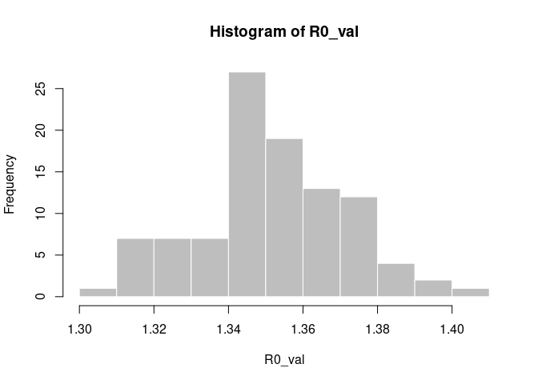
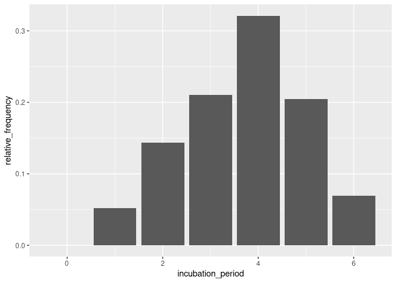
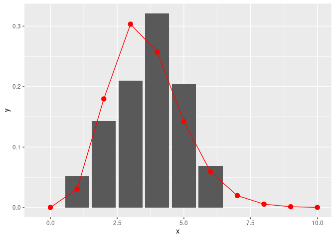

<!-- README.md is generated from README.Rmd. Please edit that file -->

# Welcome to the *epitrix* package\!

<!-- badges: start -->

[](https://github.com/reconhub/epitrix/actions/workflows/R-CMD-check.yaml)
[](https://codecov.io/github/reconhub/epitrix?branch=master)
[](https://cran.r-project.org/package=epitrix)
[](https://cran.r-project.org/package=epitrix)
[](http://www.r-pkg.org/pkg/epitrix)
[](https://app.codecov.io/gh/reconhub/epitrix?branch=master)
<!-- badges: end -->

This package implements small helper functions usefull in infectious
disease modelling and epidemics analysis.

## Installing the package

To install the current stable, CRAN version of the package, type:

``` r
install.packages("epitrix")
```

To benefit from the latest features and bug fixes, install the
development, *github* version of the package using:

``` r
devtools::install_github("reconhub/epitrix")
```

Note that this requires the package *devtools* installed.

# What does it do?

The main features of the package include:

  - **`gamma_shapescale2mucv`**: convert shape and scale of a Gamma
    distribution to mean and CV

  - **`gamma_mucv2shapescale`**: convert mean and CV of a Gamma
    distribution to shape and scale

  - **`gamma_log_likelihood`**: Gamma log-likelihood using mean and CV

  - **`r2R0`**: convert growth rate into a reproduction number

  - **`lm2R0_sample`**: generates a distribution of R0 from a
    log-incidence linear model

  - **`fit_disc_gamma`**: fits a discretised Gamma distribution to data
    (typically useful for describing delays)

  - **`clean_labels`**: generate portable labels by removing
    non-standard characters or replacing them with their closest
    alphanumeric matches, standardising separators, etc.

  - **`hash_names`**: generate unique, anonymised, reproducible labels
    from various data fields (e.g. First name, Last name, Date of
    birth).

  - **`emperical_incubation_dist()`** will estimate the empirical
    incubation distribution if given a data frame with dates of onset
    and a range of exposure dates.

  - **`fit_gamma_incubation_dist()`** wraps
    `empirical_incubation_dist()` and `fit_disc_gamma()` to fit a
    discretized gamma distribution to an empirical incubation
    distribution

  - **`AR2R0()`** calculates the R0 corresponding to a give attack rate

  - **`R02AR()`** calculates the attack rate corresponding to a give R0

  - **`R02herd_immunity_threshold()`** calculates the herd immunity
    threshold for a given R0

  - **`sim_linelist()`** simulates a simple linelist (with no epi model
    implied) `data.frame` which can be used for illustrating other
    functions

# Resources

## Worked examples

### Fitting a gamma distribution to delay data

In this example, we simulate data which replicate the serial interval
(SI), i.e. the delays between primary and secondary symptom onsets, in
Ebola Virus Disease (EVD). We start by converting previously estimates
of the mean and standard deviation of the SI (WHO Ebola Response Team
(2014) NEJM 371:1481–1495) to the parameters of a Gamma distribution:

``` r
library(epitrix)

mu <- 15.3 # mean in days days
sigma <- 9.3 # standard deviation in days
cv <- sigma / mu # coefficient of variation
cv
#> [1] 0.6078431
param <- gamma_mucv2shapescale(mu, cv) # convertion to Gamma parameters
param
#> $shape
#> [1] 2.706556
#> 
#> $scale
#> [1] 5.652941
```

The *shape* and *scale* are parameters of a Gamma distribution we can
use to generate delays. However, delays are typically reported per days,
which implies a discretisation (from continuous time to discrete
numbers). We use the package
[*distcrete*](https://github.com/reconhub/distcrete) to achieve this
discretisation. It generates a list of functions, including one to
simulate data (`$r`), which we use to simulate 500 delays:

``` r

si <- distcrete::distcrete("gamma", interval = 1,
               shape = param$shape,
               scale = param$scale, w = 0)
si
#> A discrete distribution
#>   name: gamma
#>   parameters:
#>     shape: 2.70655567117586
#>     scale: 5.65294117647059
set.seed(1)
x <- si$r(500)
head(x, 10)
#>  [1]  8 10 15 28  7 27 32 17 16  4
hist(x, col = "grey", border = "white",
     xlab = "Days between primary and secondary onset",
     main = "Simulated serial intervals")
```


`x` contains simulated data, for illustrative purpose. In practice, one
would use real data from an ongoing outbreaks. Now we use
`fit_disc_gamma` to estimate the parameters of a dicretised Gamma
distribution from the data:

``` r

si_fit <- fit_disc_gamma(x)
si_fit
#> $mu
#> [1] 15.21973
#> 
#> $cv
#> [1] 0.585091
#> 
#> $sd
#> [1] 8.90493
#> 
#> $ll
#> [1] -1741.393
#> 
#> $converged
#> [1] TRUE
#> 
#> $distribution
#> A discrete distribution
#>   name: gamma
#>   parameters:
#>     shape: 2.9211452090504
#>     scale: 5.21019425891896
```

### Converting a growth rate (r) to a reproduction number (R0)

The package [*incidence*](https://github.com/reconhub/incidence) can fit
a log-linear model to incidence curves (function `fit`), which produces
a growth rate (r). This growth rate can in turn be translated into a
basic reproduction number (R0) using `r2R0`. We illustrate this using
simulated Ebola data from the
[*outbreaks*](https://github.com/reconhub/outbreaks) package, and using
the serial interval from the previous example:

``` r

library(outbreaks)
library(incidence)

i <- incidence(ebola_sim$linelist$date_of_onset)
i
#> <incidence object>
#> [5888 cases from days 2014-04-07 to 2015-04-30]
#> 
#> $counts: matrix with 389 rows and 1 columns
#> $n: 5888 cases in total
#> $dates: 389 dates marking the left-side of bins
#> $interval: 1 day
#> $timespan: 389 days
#> $cumulative: FALSE
f <- fit(i[1:150]) # fit on first 150 days
#> Warning in fit(i[1:150]): 22 dates with incidence of 0 ignored for fitting
plot(i[1:200], fit = f, color = "#9fc2fc")
#> Warning: The `guide` argument in `scale_*()` cannot be `FALSE`. This was deprecated in
#> ggplot2 3.3.4.
#> ℹ Please use "none" instead.
#> ℹ The deprecated feature was likely used in the incidence package.
#>   Please report the issue at <]8;;https://github.com/reconhub/incidence/issueshttps://github.com/reconhub/incidence/issues]8;;>.
```


``` r

r2R0(f$info$r, si$d(1:100))
#> [1] 1.348624
r2R0(f$info$r.conf, si$d(1:100))
#>         2.5 %   97.5 %
#> [1,] 1.314055 1.383674
```

In addition, we can also use the function `lm2R0_sample` to generate
samples of R0 values compatible with a model fit:

``` r

R0_val <- lm2R0_sample(f$model, si$d(1:100), n = 100)
head(R0_val)
#> [1] 1.350970 1.347374 1.350076 1.358523 1.341549 1.341634
hist(R0_val, col = "grey", border = "white")
```



### Standardising labels

If you want to use labels that will work across different computers,
independent of local encoding and operating systems, `clean_labels` will
make your life easier. The function transforms character strings by
replacing diacritic symbols with their closest alphanumeric matches,
setting all characters to lower case, and replacing various separators
with a single, consistent one.

For instance:

``` r
x <- " Thîs- is A   wêïrD LäBeL .."
x
#> [1] " Thîs- is A   wêïrD LäBeL .."
clean_labels(x)
#> [1] "this_is_a_weird_label"

variables <- c("Date.of.ONSET ",
               "/  date of hôspitalisation  /",
               "-DäTÈ--OF___DîSCHARGE-",
               "GEndèr/",
               "  Location. ")
variables
#> [1] "Date.of.ONSET "                "/  date of hôspitalisation  /"
#> [3] "-DäTÈ--OF___DîSCHARGE-"        "GEndèr/"                      
#> [5] "  Location. "
clean_labels(variables)
#> [1] "date_of_onset"           "date_of_hospitalisation"
#> [3] "date_of_discharge"       "gender"                 
#> [5] "location"
```

### Anonymising data

`hash_names` can be used to generate hashed labels from linelist data.
Based on pre-defined fields, it will generate anonymous labels. This
system has the following desirable features:

  - given the same input, the output will always be the same, so this
    encoding system generates labels which can be used by different
    people and organisations

  - given different inputs, the output will always be different; even
    minor differences in input will result in entirely different outputs

  - given an output, it is very hard to infer the input (it requires
    hacking skills); if security is challenged, the hashing algorithm
    can be ‘salted’ to strengthen security

<!-- end list -->

``` r

first_name <- c("Jane", "Joe", "Raoul", "Raoul")
last_name <- c("Doe", "Smith", "Dupont", "Dupond")
age <- c(25, 69, 36, 36)

## detailed output by default
hash_names(first_name, last_name, age)
#>             label hash_short
#> 1     jane_doe_25     6485f2
#> 2    joe_smith_69     ea1ccc
#> 3 raoul_dupont_36     f60676
#> 4 raoul_dupond_36     cd7104
#>                                                               hash
#> 1 6485f29654c5a9d55625cd6efeb96d569917e1c272790959ad3fa132c6d51648
#> 2 ea1cccce320aa45a0d694ea12c30ff6b4b52c67f69d58b23dad5441ea17c5807
#> 3 f60676d1c11ae5badc0e5ec4dfde06eaba817a78f3d54eb327a25df485ec1efd
#> 4 cd7104e7e7009bfd988d5a4b46a930424908736065573e51a85d16575ed7c2a5

## short labels for practical use
hash_names(first_name, last_name, age,
           size = 8, full = FALSE)
#> [1] "6485f296" "ea1cccce" "f60676d1" "cd7104e7"
```

### Estimate incubation periods

The function `empirical_incubation_dist()` computes the discrete
probability distribution by giving equal weight to each patient. Thus,
in the case of `N` patients, the `n` possible exposure dates of a given
patient get the overall weight `1/(n*N)`. The function returns a data
frame with column `incubation_period` containing the different
incubation periods with a time step of one day and their
`relative_frequency`.

Load environment:

``` r
library(magrittr)
library(tibble)
library(epitrix)
library(distcrete)
library(ggplot2)
```

Make a linelist object containing toy data with several possible
exposure dates for each case:

``` r
ll <- sim_linelist(30) %>%
  tibble()

x <- 0:15
y <- distcrete("gamma", 1, shape = 12, rate = 3, w = 0)$d(x)
mkexposures <- function(i) i - sample(x, size = sample.int(5, size = 1), replace = FALSE, prob = y)
exposures <- sapply(ll$date_of_onset, mkexposures)
ll$dates_exposure <- exposures

print(ll)
#> # A tibble: 30 × 6
#>       id date_of_onset date_of_report gender outcome  dates_exposure
#>    <int> <date>        <date>         <chr>  <chr>    <list>        
#>  1     1 2020-01-23    2020-02-01     male   recovery <date [1]>    
#>  2     2 2020-02-14    2020-02-22     female recovery <date [3]>    
#>  3     3 2020-01-25    2020-01-30     male   recovery <date [4]>    
#>  4     4 2020-01-16    2020-01-21     male   recovery <date [3]>    
#>  5     5 2020-01-22    2020-01-27     female recovery <date [2]>    
#>  6     6 2020-01-26    2020-02-02     male   recovery <date [2]>    
#>  7     7 2020-02-09    2020-02-17     female death    <date [5]>    
#>  8     8 2020-02-17    2020-02-23     male   recovery <date [2]>    
#>  9     9 2020-01-14    2020-01-26     male   recovery <date [4]>    
#> 10    10 2020-02-22    2020-02-26     female recovery <date [4]>    
#> # … with 20 more rows
```

Empirical distribution:

``` r
incubation_period_dist <- empirical_incubation_dist(ll, date_of_onset, dates_exposure)
print(incubation_period_dist)
#> # A tibble: 7 × 2
#>   incubation_period relative_frequency
#>               <dbl>              <dbl>
#> 1                 0             0     
#> 2                 1             0.0522
#> 3                 2             0.143 
#> 4                 3             0.21  
#> 5                 4             0.321 
#> 6                 5             0.204 
#> 7                 6             0.0689

ggplot(incubation_period_dist, aes(incubation_period, relative_frequency)) +
  geom_col()
```



Fit discrete gamma:

``` r
fit <- fit_gamma_incubation_dist(ll, date_of_onset, dates_exposure)
print(fit)
#> $mu
#> [1] 4.096257
#> 
#> $cv
#> [1] 0.323797
#> 
#> $sd
#> [1] 1.326356
#> 
#> $ll
#> [1] -1702.111
#> 
#> $converged
#> [1] TRUE
#> 
#> $distribution
#> A discrete distribution
#>   name: gamma
#>   parameters:
#>     shape: 9.5379337636799
#>     scale: 0.429470107801068

x = c(0:10)
y = fit$distribution$d(x)
ggplot(data.frame(x = x, y = y), aes(x, y)) +
  geom_col(data = incubation_period_dist, aes(incubation_period, relative_frequency)) +
  geom_point(stat="identity", col = "red", size = 3) +
  geom_line(stat="identity", col = "red")
```



**Note** that if the possible exposure dates are consecutive for all
patients then `empirical_incubation_dist()` and
`fit_gamma_incubation_dist()` can take date ranges as inputs instead of
lists of individual exposure dates (see help for details).

## Vignettes

The [overview
vignette](http://www.repidemicsconsortium.org/epitrix/articles/epitrix.html)
essentially replicates the content of this `README`. To request or
contribute other vignettes, see the section “*getting help,
contributing*”.

The [estimate incubation
vignette](http://www.repidemicsconsortium.org/epitrix/articles/estimate_incubation.html)
contains worked examples for the `emperical_incubation_dist()`
`fit_gamma_incubation_dist()`.

## Websites

Click [here](http://www.repidemicsconsortium.org/epitrix/) for the
website dedicated to *epitrix*.

## Getting help, contributing

Bug reports and feature requests should be posted on *github* using the
[*issue*](http://github.com/reconhub/epitrix/issues) system. All other
questions should be posted on the [**RECON
forum**](http://www.repidemicsconsortium.org/forum/).

Contributions are welcome via **pull requests**.

Please note that this project is released with a [Contributor Code of
Conduct](CONDUCT.md). By participating in this project you agree to
abide by its terms.
