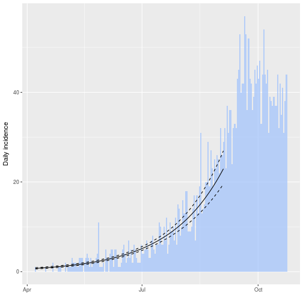
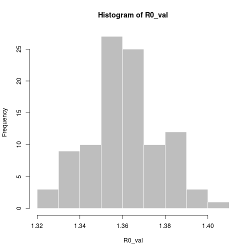

[](https://ci.appveyor.com/project/thibautjombart/epitrix/branch/master)
[](https://travis-ci.org/reconhub/epitrix)
[](https://codecov.io/github/reconhub/epitrix?branch=master)
[](https://cran.r-project.org/package=epitrix)


# Welcome to the *epitrix* package!

This package implements small helper functions usefull in infectious disease
modelling and epidemics analysis.


## Installing the package

To install the current stable, CRAN version of the package, type:

```r
install.packages("epitrix")
```

To benefit from the latest features and bug fixes, install the development,
*github* version of the package using:


```r
devtools::install_github("reconhub/epitrix")
```

Note that this requires the package *devtools* installed.


# What does it do?

The main features of the package include:

- **`gamma_shapescale2mucv`**: convert shape and scale of a Gamma distribution
    to mean and CV

- **`gamma_mucv2shapescale`**: convert mean and CV of a Gamma distribution to
    shape and scale

- **`gamma_log_likelihood`**: Gamma log-likelihood using mean and CV

- **`r2R0`**: convert growth rate into a reproduction number

- **`lm2R0_sample`**: generates a distribution of R0 from a log-incidence linear
    model

- **`fit_disc_gamma`**: fits a discretised Gamma distribution to data (typically
    useful for describing delays)

- **`hash_names`**: generate unique, anonymised, reproducible labels from
    various data fields (e.g. First name, Last name, Date of birth).


# Resources

## Worked examples


### Fitting a gamma distribution to delay data

In this example, we simulate data which replicate the serial interval (SI),
i.e. the delays between primary and secondary symptom onsets, in Ebola Virus
Disease (EVD). We start by converting previously estimates of the mean and
standard deviation of the SI (WHO Ebola Response Team (2014) NEJM 371:1481–1495)
to the parameters of a Gamma distribution:


```r
library(epitrix)

mu <- 15.3 # mean in days days
sigma <- 9.3 # standard deviation in days
cv <- mu/sigma # coefficient of variation
cv
```

```
## [1] 1.645161
```

```r
param <- gamma_mucv2shapescale(mu, cv) # convertion to Gamma parameters
param
```

```
## $shape
## [1] 0.3694733
## 
## $scale
## [1] 41.4103
```

The *shape* and *scale* are parameters of a Gamma distribution we can use to
generate delays. However, delays are typically reported per days, which implies
a discretisation (from continuous time to discrete numbers). We use the package
[*distcrete*](https://github.com/reconhub/distcrete) to achieve this
discretisation. It generates a list of functions, including one to simulate data
(`$r`), which we use to simulate 500 delays:


```r
si <- distcrete::distcrete("gamma", interval = 1,
               shape = param$shape,
               scale = param$scale, w = 0)
si
```

```
## A discrete distribution
##   name: gamma
##   parameters:
##     shape: 0.369473279507882
##     scale: 41.4103017689906
```

```r
set.seed(1)
x <- si$r(500)
head(x, 10)
```

```
##  [1]  0  2  7 46  0 43 62 12 10  0
```

```r
hist(x, col = "grey", border = "white",
     xlab = "Days between primary and secondary onset",
     main = "Simulated serial intervals")
```


`x` contains simulated data, for illustrative purpose. In practice, one would
use real data from an ongoing outbreaks. Now we use `fit_disc_gamma` to estimate
the parameters of a dicretised Gamma distribution from the data:


```r
si_fit <- fit_disc_gamma(x)
si_fit
```

```
## $mu
## [1] 15.01017
## 
## $cv
## [1] 1.656824
## 
## $sd
## [1] 24.8692
## 
## $ll
## [1] -1689.073
## 
## $converged
## [1] TRUE
```


### Converting a growth rate (r) to a reproduction number (R0)

The package [*incidence*](https://github.com/reconhub/incidence) can fit a
log-linear model to incidence curves (function `fit`), which produces a growth
rate (r). This growth rate can in turn be translated into a basic reproduction
number (R0) using `r2R0`. We illustrate this using simulated Ebola data from the
[*outbreaks*](https://github.com/reconhub/outbreaks) package, and using the
serial interval from the previous example:


```r
library(outbreaks)
library(incidence)

i <- incidence(ebola_sim$linelist$date_of_onset)
i
```

```
## <incidence object>
## [5888 cases from days 2014-04-07 to 2015-04-30]
## 
## $counts: matrix with 389 rows and 1 columns
## $n: 5888 cases in total
## $dates: 389 dates marking the left-side of bins
## $interval: 1 day
## $timespan: 389 days
```

```r
f <- fit(i[1:150]) # fit on first 150 days
```

```
## Warning in fit(i[1:150]): 22 dates with incidence of 0 ignored for fitting
```

```r
plot(i[1:200], fit = f, color = "#9fc2fc")
```



```r
r2R0(f$info$r, si$d(1:100))
```

```
## [1] 1.358887
```

```r
r2R0(f$info$r.conf, si$d(1:100))
```

```
##         2.5 %   97.5 %
## [1,] 1.328372 1.388925
```

In addition, we can also use the function `lm2R0_sample` to generate samples of
R0 values compatible with a model fit:


```r
R0_val <- lm2R0_sample(f$lm, si$d(1:100), n = 100)
head(R0_val)
```

```
## [1] 1.360925 1.357800 1.360150 1.367461 1.352716 1.352790
```

```r
hist(R0_val, col = "grey", border = "white")
```




### Anonymising data

`hash_names` can be used to generate hashed labels from linelist data. Based on
pre-defined fields, it will generate anonymous labels. This system has the
following desirable features:

- given the same input, the output will always be the same, so this encoding
  system generates labels which can be used by different people and
  organisations

- given different inputs, the output will always be different; even minor
  differences in input will result in entirely different outputs

- given an output, it is very hard to infer the input (it requires hacking
  skills); if security is challenged, the hashing algorithm can be 'salted' to
  strengthen security


```r
first_name <- c("Jane", "Joe", "Raoul", "Raoul")
last_name <- c("Doe", "Smith", "Dupont", "Dupond")
age <- c(25, 69, 36, 36)

## detailed output by default
hash_names(first_name, last_name, age)
```

```
##           label hash_short                                     hash
## 1     janedoe25     274be0 274be0e34366ab2b8798adb31ad161ea8441c410
## 2    joesmith69     4c20ad 4c20ad4911e4941eaa3c12023440da406eaf3353
## 3 raouldupont36     4573ee 4573ee25d7f395d94a89c2fea71bfed27933b6d9
## 4 raouldupond36     d0e0f4 d0e0f421e546c7902c30faefe58be41aa4ed01d3
```

```r
## short labels for practical use
hash_names(first_name, last_name, age,
           size = 8, full = FALSE)
```

```
## [1] "274be0e3" "4c20ad49" "4573ee25" "d0e0f421"
```


## Vignettes

The [overview vignette](http://www.repidemicsconsortium.org/epitrix/articles/epitrix.html)
essentially replicates the content of this `README`. To request or contribute
other vignettes, see the section "*getting help, contributing*".


## Websites

Click [here](http://www.repidemicsconsortium.org/epitrix/) for the website
dedicated to *epitrix*.


## Getting help, contributing

Bug reports and feature requests should be posted on *github* using the
[*issue*](http://github.com/reconhub/epitrix/issues) system. All other questions
should be posted on the [**RECON forum**](http://www.repidemicsconsortium.org/forum/).

Contributions are welcome via **pull requests**.

Please note that this project is released with a 
[Contributor Code of Conduct](CONDUCT.md). 
By participating in this project you agree to abide by its terms.

